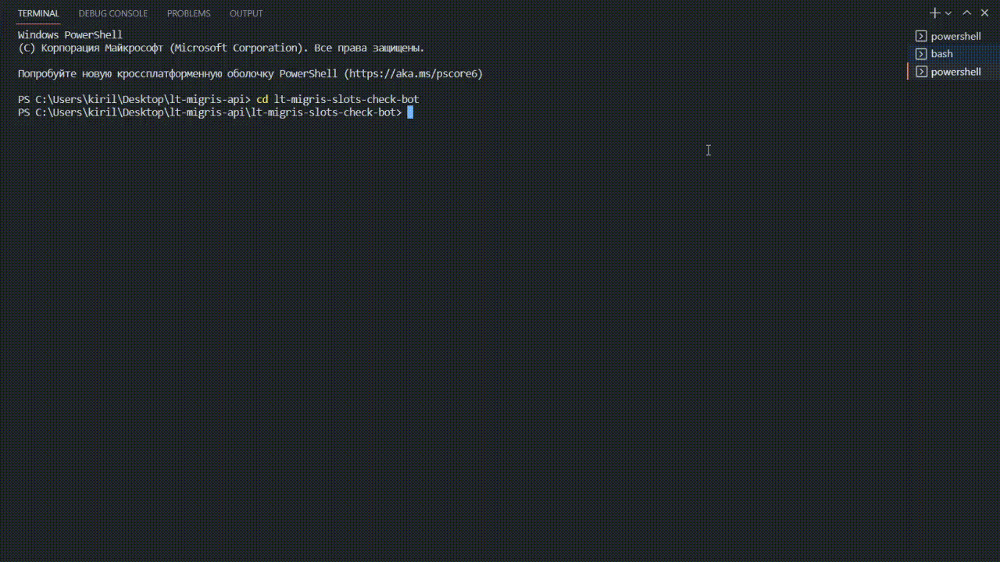
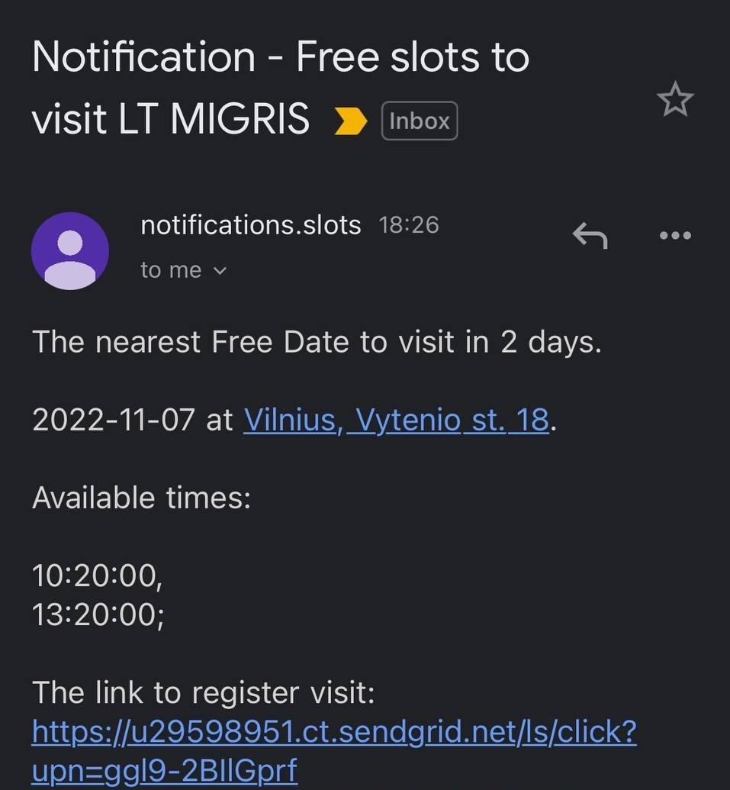

# lt-migris-slots-check-bot
> Bot for checking the availability of slots to visit the [Lithuanian MIGRIS](https://www.migracija.lt/). Notifications will be sent by email.
> 
> **For local usage.**

## Usage

```javascript
node bot
OR
npm run bot
```


#### Email notifications

To getting email notifications have to setup **Free** [SendGrid](https://sendgrid.com/) account:
1. Register SendGrid account: https://signup.sendgrid.com/
2. Create and verify SendGrid Sender: https://docs.sendgrid.com/ui/sending-email/sender-verification
3. Create SendGrid API key: https://docs.sendgrid.com/ui/account-and-settings/api-keys#creating-an-api-key

Check [Variables reference](#variables-reference) 
or [.env](https://github.com/kirill-bulyshkin/lt-migris-slots-check-bot/blob/main/.env) to get more details.

#### Example of received notification:



## Installation

With [npm](https://npmjs.org/):

```shell
npm install lt-migris-slots-check-bot
```

## Configuration

#### Variables reference

Default values are provided as an example to help you figure out what should be entered.

| Name                       | Default value                                 | Description                                                                       |
| -------------------------- | ----------------------------------------------| ----------------------------------------------------------------------------------|
| DAYS_TO_CHECK              | 30                                            | Number of days that will be checked for free slots to visit                       |
| TYPE_OF_VISIT              | "Documents issued to foreigners - collection" | Type of visit that will be checked                                                |
| ADDRESS                    | "Vilnius, Vytenio st. 18"                     | Full address of institution that will be checked                                  |
| EMAIL_OF_RECEIVER          | "name@mail.com"                               | Email address of receiver to get notifications                                    |
| EMAIL_OF_SENDER            | "notifications@mail.com"                      | Email address of created and verified SendGrid Sender                             |
| API_KEY                    | "{api_key}"                                   | Application Programming Interface key to authenticate access to SendGrid services |
| SCHEDULE_OF_CHECK          | "*/20 * * * *"                                | Cron-expression to run bot by needed schedule (in the example - each 20 minutes)   |


## See Also

- [`simple editor for cron schedule expressions`](https://crontab.guru/)
- [`sendgrid sending emails - full documentation`](https://docs.sendgrid.com/ui/sending-email)
- [`migris visit reserve page`](https://www.migracija.lt/app/visit-reserve)

## License

This project is licensed under the MIT license. Feel free to edit and distribute this template as you like.

See [LICENSE](https://github.com/kirill-bulyshkin/lt-migris-slots-check-bot/blob/api-local-run/LICENSE) for more information.
